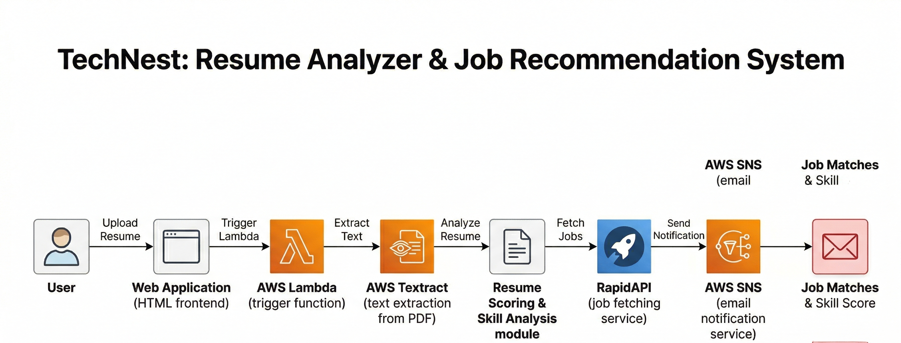

# 📄 TechNest — Resume Analyzer & Job Recommendation System

## 🚀 Overview
TechNest is a serverless application that analyzes resumes, identifies skill gaps, and recommends relevant jobs and internships. It leverages AWS services and external APIs to automate resume evaluation and provide actionable insights.

---

## 🏗 Architecture
The system follows an event-driven, serverless architecture:

User → Web Interface → AWS Lambda → AWS Textract → Skill Analysis → RapidAPI → AWS SNS → Email Output



---

## ⚙️ Tech Stack

### ☁️ Cloud Services
- AWS Lambda  
- AWS Textract  
- AWS SNS  

### 🔧 Backend
- Python (Boto3)

### 🌐 API Integration
- RapidAPI (Job & Internship Data)

### 🎨 Frontend
- HTML

---

## 🔄 Workflow

1. User uploads resume (PDF) through web interface  
2. AWS Lambda function is triggered  
3. AWS Textract extracts text from resume  
4. Custom logic analyzes skills and calculates score  
5. Missing skills are identified using keyword matching  
6. RapidAPI fetches relevant job/internship listings  
7. AWS SNS sends results via email  
8. User receives skill score and job recommendations  


```md

